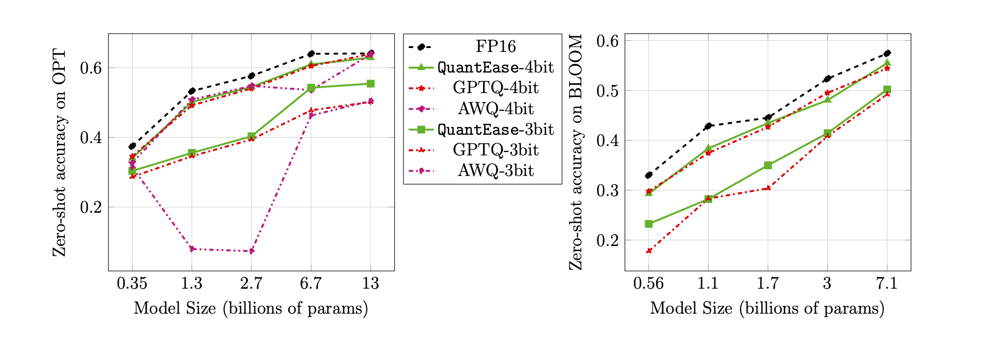

# QuantEase


This repository contains the codes for the paper [QuantEase: Optimization-based Quantization for Language Models - An Efficient and Intuitive Algorithm](https://arxiv.org/pdf/2309.01885.pdf)

## Abstract

With the growing popularity of Large Language Models (LLMs), there is an increasing interest in compression techniques for their efficient deployment. This study focuses on Post-Training Quantization for LLMs, introducing QuantEase, a layer-wise quantization framework where individual layers undergo separate quantization. Framing the problem as discrete-structured non-convex optimization, our work develops Coordinate Descent techniques, offering high-quality solutions without the need for matrix inversion or decomposition. We also explore an outlier-aware variant, preserving significant weights with complete precision. Our proposal achieves state-of-the-art performance in empirical evaluations across various LLMs and datasets, with up to 15\% improvements over methods like GPTQ. With careful linear algebra optimizations, QuantEase quantizes models like Falcon-180B on a single NVIDIA A100 GPU in approximately three hours. The outlier-aware algorithm achieves near or sub-3-bit quantization with an acceptable accuracy drop, outperforming methods like SpQR by up to two times in terms of perplexity.

Selected WikiText2 perplexity results for BLOOM, OPT, and Falcon model family without grouping:

| Model Name | FP16  | 4bit  | 3bit  | 3bit-structured outlier (1%) | 3bit-unstructured outlier (1%) |
|:----------:|:-----:|:-----:|:-----:|:----------------------------:|:------------------------------:|
|  OPT-1.3B  | 14.62 | 15.28 | 21.30 |            18.51             |             16.25              |
|  OPT-13B   | 10.13 | 10.32 | 12.41 |            12.07             |             10.37              |
| BLOOM-1B7  | 15.39 | 16.11 | 20.03 |            18.89             |             17.06              |
| BLOOM-7B1  | 11.37 | 11.69 | 13.43 |            12.97             |             12.03              |
| Falcon-7B  | 6.59  | 6.92  | 8.83  |             8.56             |              7.14              |
| Falcon-40B | 5.23  | 5.46  | 6.20  |             5.99             |              5.51              |


Zero-Shot accuracy on the [LAMBADA](https://github.com/EleutherAI/lm-evaluation-harness/blob/master/lm_eval/tasks/lambada.py) benchmark for 3-bit and 4-bit quantization:



## Contained Algorithms
* `quantease`: proposed basic QuantEase algorithm with accelerated implementation following Algorithm 2 in the [paper](https://arxiv.org/pdf/2309.01885.pdf).
* `quantease_outlier`: outlier-aware QuantEase algorithm with accelerated implementation following Algorithm 3 in the [paper](https://arxiv.org/pdf/2309.01885.pdf).
* `rtn`: baseline round-to-nearest algorithm.
* `gptq_quantease`: a combined algorithm of GPTQ + QuantEase. Initialized with GPTQ in the first iteration, and then do QuantEase on top of it for further performance optimization.


## How to run the scripts

### Prepare datasets and models
* We prepare the calibration and evaluation datasets in the `data` folder.
* Please create the `models` folder under the `QuantEase` root dir and download the huggingface models to be quantized in it with the name you preferred.

### Install required dependencies
```shell
pip3 install -r requirements.txt
```
* `torch`: tested on v2.0.0+cu118
* `transformers`: tested on v4.35.0
* `scipy`: tested on v1.11.3
* `einops`: tested on v0.7.0
* `datasets`: tested on v2.14.7
* `scikit-learn`: tested on v1.4.0
* `sacrebleu`: tested on v2.3.1
* (Optional) `auto-gptq`: tested on v0.5.0 (used for packing the models only), if you want to pack and export the quantized model, please follow the instruction on the AutoGPTQ page to install https://github.com/PanQiWei/AutoGPTQ

All scripts have been tested with single A100 NVIDIA GPU machine with CUDA 12.0 driver API version and 11.2 runtime API version.

### Running the quantization scripts with evaluations
We currently support the quantization of three model families: [BLOOM](https://huggingface.co/docs/transformers/model_doc/bloom), [OPT](https://huggingface.co/docs/transformers/model_doc/opt), [Falcon](https://huggingface.co/docs/transformers/model_doc/falcon), [Mistral-7b](https://huggingface.co/docs/transformers/model_doc/mistral), [LLAMA](https://huggingface.co/docs/transformers/model_doc/llama)

```shell
# within the `QuantEase` root folder run:
python3 model_quantizer.py --model `models/<model_name>` --dataset  c4 --wbits 4 --num-iter 30 --nsamples 128 --true-sequential --quantization-method <algorithm_name>
```
* `model_name`: e.g., `bloom-560m`, `opt-350m` and `falcon-7b`, etc. Our script will automatically pick the corresponding model type / config based on model name
* `algorithm_name`: choose from `quantease`, `rtn` and `gptq_quantease`

To enable outlier-aware algorithm, please provide extra argument: `--outlier`:
```shell
# within the `QuantEase` root folder run:
python3 model_quantizer.py --model `models/<model_name>` --dataset  c4 --wbits 4 --num-iter 30 --nsamples 128 --true-sequential --quantization-method <outlier_aware_algorithm_name> --outlier 0.01
```
* `outlier_aware_algorithm_name`: choose from `spqr` and `quantease`. **Note:** The `outlier` argument for QuantEase indicates the percentage of weights to be selected as outliers from each layer but for SpQR method, it refers to the `outlier_relative_threshold` which is often larger than the true outlier ratio, please refer to the original paper [code](https://github.com/Vahe1994/SpQR) and [paper](https://arxiv.org/pdf/2306.03078.pdf) for more detailed hyperparamter setup.
  To enabled the structured outlier quantization for QuantEase, please add `--structure-outlier` in the running command.

### Extra supported arguments

* `--compute-quantization-recon-error`: display reconstruction errors for each layer during quantization for debugging purpose. More time and memory is needed if enabled.
* `--groupsize`: groupsize to use for quantization; default uses full row.
* `--act-order`: whether to apply the activation order GPTQ heuristic, it's a new feature in GPTQ codebase that is shown to perform well in most cases and alleviate the numerical issue during quantization.
* `--save <path_to_save_the_model_and_results>` : enable perplexity results saving in json and quantized model packing/saving. Make sure you installed `auto-gptq` package to leverage the QuantLinear layer and CUDA kernel to help pack and save the model.
* `--num-layers-to-quantize`: how many blocks to quantize from top to bottom (mainly used for debugging purpose).


## Cite this work

Biblatex entry:

```bibtex
@article{behdin2023quantease,
  title={QuantEase: Optimization-based Quantization for Language Models--An Efficient and Intuitive Algorithm},
  author={Behdin, Kayhan and Acharya, Ayan and Gupta, Aman and Keerthi, Sathiya and Mazumder, Rahul and Siyu, Zhu and Qingquan, Song},
  journal={arXiv preprint arXiv:2309.01885},
  year={2023}
}
```

## Acknowledgements

Kayhan Behdin contributed to this work while he was an intern at LinkedIn during summer 2023. This work
is not a part of his MIT research. Rahul Mazumder contributed to this work while he was a consultant for
LinkedIn (in compliance with MIT’s outside professional activities policies). This work is not a part of his
MIT research.